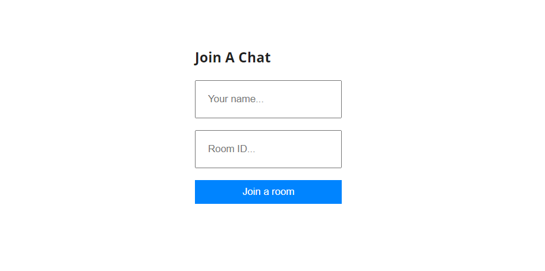
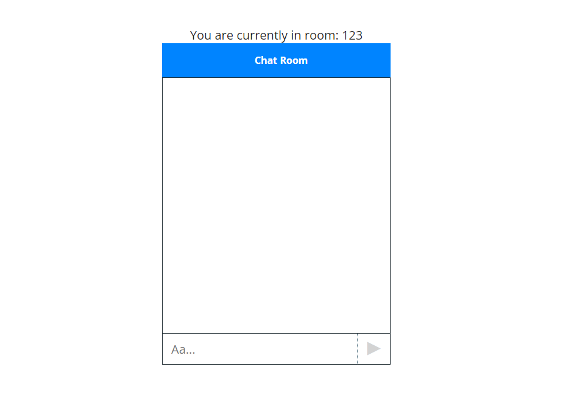
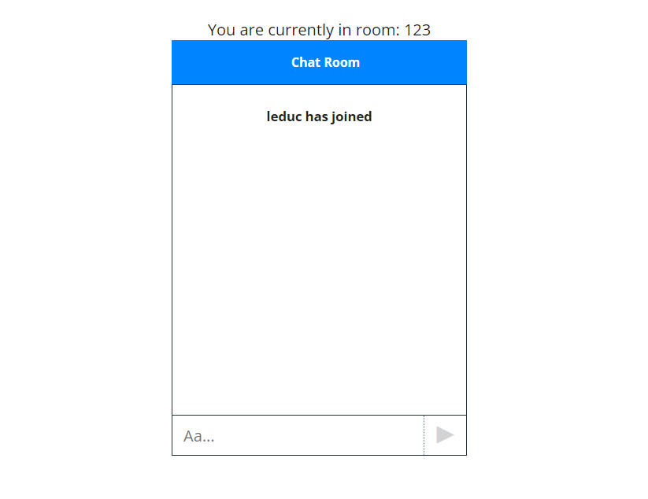
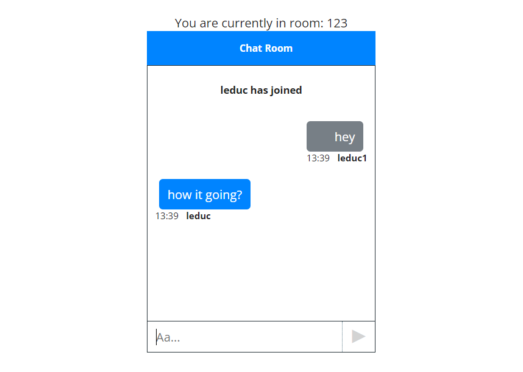

# Chat_app_websocket

## Getting started - to run this app

- At server

```
cd websocket-chat-box-server
npm i
npm start
```

- At client

```
cd websocket-chat-box
npm i
npm start
```

# How it run

Join a chat by inputing name and roomID (any room ID)


Once entered the chat, the screen would look like this


If anyone joined the chat (with the same roomID), there would be a message shown in the chat box


Start chating

